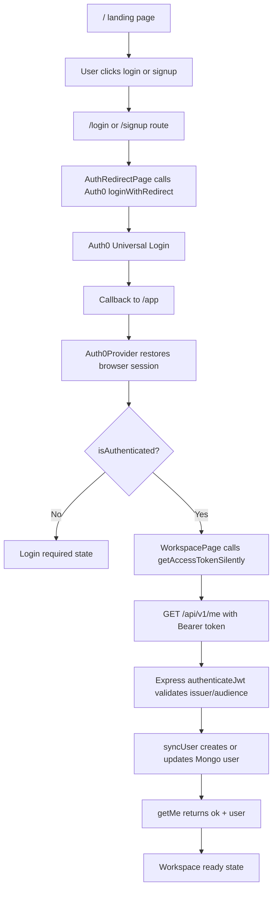

# Client Server Flow Report

Date: 2026-05-03

## Current Flow Summary

The app currently supports this real path:

```txt
Landing page
  -> /login or /signup
  -> Auth0 Universal Login
  -> browser returns to /app
  -> Auth0 React SDK restores authenticated state
  -> client requests API access token
  -> GET http://localhost:4000/api/v1/me
  -> server validates JWT with Auth0 issuer and audience
  -> server syncs Auth0 subject/profile claims into MongoDB users
  -> workspace shell renders with user name/email
```

The flow is minimal and useful. It does not yet include resume projects, uploads, templates, editor state, or protected project APIs.

## Route And State Diagram



## Client Flow

### App composition

`client/src/main.jsx` mounts React in strict mode and wraps the app with `AppAuthProvider`.

`client/src/App.jsx` currently acts as the composition root, router, and theme owner:

- Reads the browser path from `window.location.pathname`.
- Stores theme in `localStorage`.
- Subscribes to local navigation events.
- Shows `AuthSetupPage` when Auth0 env config is missing and the route needs auth.
- Routes `/login`, `/signup`, `/app`, and the landing page.

This is acceptable at the current size, but it is already a pressure point. Once project setup/editor/settings routes are added, routing and theme should be split out before `App.jsx` becomes a dumping ground.

### Auth setup gate

`client/src/auth/auth-config.js` reads:

- `VITE_AUTH0_DOMAIN`
- `VITE_AUTH0_CLIENT_ID`
- `VITE_AUTH0_AUDIENCE`

If any are missing, auth routes render `AuthSetupPage`. That helps local setup, but the copy is developer-facing and should not appear in production.

### Login and signup redirect

`client/src/pages/auth/AuthRedirectPage.jsx` redirects unauthenticated users through Auth0:

- `/login` calls `login('/app')`.
- `/signup` calls `signup('/app')`.
- `signup` adds `screen_hint: 'signup'`.
- Both request `openid profile email` and the configured API audience.

The redirect logic is simple and correct for the current app. The missing piece is handling redirect failures or Auth0 callback query errors cleanly.

### Auth0 provider

`client/src/auth/AuthProvider.jsx` configures Auth0 with:

- Domain
- Client ID
- API audience
- Redirect URI: `/app`
- Scope: `openid profile email`
- `cacheLocation="localstorage"`

The localStorage token cache is the biggest client-side auth security tradeoff. It helps session persistence across refreshes, but any future XSS could expose long-lived browser tokens. For a resume product that will later handle sensitive profile and employment data, default memory storage is safer unless persistence is a deliberate product decision.

### Workspace gate

`client/src/pages/workspace/WorkspacePage.jsx` has four visible states:

- Loading spinner while Auth0 or `/me` is loading.
- `Login required` when the Auth0 SDK says the user is not authenticated.
- `Workspace unavailable` when `/me` fails.
- Ready workspace shell when `/me` returns a user.

This is logically good: the browser session alone is not enough. The app waits for the backend to validate the token and load the account.

The hole is that the error path loses details. `fetchCurrentUser` throws one generic message and discards the backend error code, status, and `x-request-id`.

## Server Flow

### App middleware order

`server/src/app.js` builds the Express app in this order:

```txt
requestIdMiddleware
helmet
cors
express.json
express.urlencoded
morgan HTTP logging
/api/v1 publicApiLimiter
/api/v1 healthRoutes
/api/v1 authenticateJwt + userRoutes
notFoundMiddleware
errorMiddleware
```

This is a good minimal order. Public health stays public, protected user routes require JWT validation, and request IDs are available to logging/error middleware.

### Auth validation

`server/src/middleware/auth.js` uses `express-oauth2-jwt-bearer` when both Auth0 env values exist:

- `AUTH0_ISSUER_BASE_URL`
- `AUTH0_AUDIENCE`

If either is missing, protected requests return `AUTH_CONFIG_MISSING` with status 503.

The logical weakness is that this is discovered only when the first protected request arrives. For development that is tolerable; for production it should fail at startup or use an explicit `AUTH_DISABLED=true` local flag.

### User sync

`server/src/middleware/sync-user.js` requires `req.auth.payload.sub` and calls `syncAuthenticatedUser`.

`server/src/modules/users/user.service.js`:

- Finds profile claims from standard or namespaced token claims.
- Cleans blank strings.
- Builds `$set` and `$unset` updates for email/name.
- Upserts by `auth0Sub`.
- Returns the Mongo user document.

This is the right shape for a minimal account sync. The future risk is that it currently does not enforce email verification, does not validate email format/length, and does not handle duplicate-key races explicitly.

### Database connection

`server/src/server.js` connects to MongoDB before listening. This is fine for the current protected `/me` flow, because user sync needs MongoDB.

The tradeoff is operational: if MongoDB is unavailable, even `/health` cannot be served because the server never starts. Later, you may want the app to listen and show database status as disconnected through the health endpoint.

## Logout Flow

`useAuthActions.logoutToHome` calls Auth0 logout and returns to the app origin. This is clean enough for now.

Because tokens are stored in browser localStorage by the Auth0 SDK, logout correctness depends on the SDK clearing the local token cache. That is expected behavior, but it is another reason token persistence should be intentional.

## Current Happy Path

1. User opens `http://localhost:5173`.
2. User clicks `Start free` or `Log in`.
3. Client redirects to Auth0 with configured audience and scope.
4. Auth0 returns to `http://localhost:5173/app`.
5. Client obtains an access token silently.
6. Client calls `http://localhost:4000/api/v1/me`.
7. Server validates issuer and audience.
8. Server upserts user by Auth0 subject.
9. Server responds:

```json
{
  "ok": true,
  "data": {
    "user": {
      "id": "...",
      "email": "...",
      "name": "..."
    }
  }
}
```

10. Workspace shell renders.

## Current Error Paths

| Failure | Current behavior | Risk |
| --- | --- | --- |
| Missing client Auth0 env | Shows auth setup page | Good locally, too technical for production |
| Auth0 redirect returns error query | Falls into normal `/app` auth handling | Real provider error can be hidden |
| User not logged in | Shows `Login required` | Good |
| Missing backend Auth0 env | Protected route returns 503 | Late discovery |
| Invalid/expired API token | Auth middleware returns error through shared handler | Good server behavior, weak client display |
| Mongo sync fails | Workspace unavailable | Correct state, too little debug context |
| Rate limit exceeded | Standard rate-limit JSON | Good for IP limit, not enough for future user quotas |

## Minimality Review

Good minimal choices:

- No custom password logic.
- No premature project/editor abstractions.
- Auth0 owns login/signup.
- API only exposes `health` and `me`.
- User sync lives in a feature module.
- Logging avoids request bodies and authorization headers.

Things that are not minimal or not needed yet:

- `cacheLocation="localstorage"` increases security scope without being required for the current flow.
- `credentials: true` in CORS is unnecessary while the API uses bearer tokens, unless cookie-based auth is planned.
- Visible but dead UI controls like `New resume` and the mobile menu create product complexity without behavior.
- Generated screenshot artifacts remain tracked in the client root.
- The landing page uses proof/testimonial copy before the product has real usage evidence.

## What Should Stay Stable

- Auth0 remains the identity provider.
- Server validates JWTs before trusting the browser.
- Local users are keyed by `auth0Sub`, not email.
- Frontend gets an API access token for the configured audience.
- Backend returns user data through `/me`.
- No passwords are stored in MongoDB.

